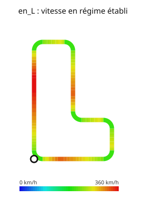

# Formula1

Modélisations autour de la Formule 1, d'après le sujet Centrale-Supélec info 2022
(PDF dans `docs/`) : géométrie de circuits à angles droits, calcul du temps de course
minimal, et un **laboratoire de 14 cas illustrés** où chaque fait affiché est calculé.



## Utilisation

```bash
python -m formula1 --exemple en_L -n 5 --svg circuit.svg
python -m formula1 ADADADAD -l 200 -r 30 -n 10 --arc
python -m formula1 --exemple en_L --svg-vitesse vitesse.svg --profil profil.svg
python -m formula1 --liste                       # les cas illustrés
python -m formula1 --cas enumeration --cas rayon # cas précis (répétable)
python -m formula1 --tout --sauver figures       # tous les cas, figures SVG enregistrées
python -m formula1 --enumerer 10 -n 5            # tous les circuits à 10 droites, classés
python -m unittest discover -s tests             # 57 tests
```

Options : `-l` longueur d'une ligne droite (m), `-r` rayon des virages (m), `-n` tours,
`--amax/--fmax/--vmax`, `--arc` (compte la durée des virages en quart de cercle),
`--svg`, `--svg-vitesse`, `--profil`, `--turtle`. Exemples prédéfinis : `carre`, `rectangle`, `en_L`.
Sans dépendance externe (bibliothèque standard uniquement, figures en SVG).

## Les 14 cas illustrés

| Cas | Ce que le programme montre |
|---|---|
| `carre` | le mot A/G/D, longueur, fermeture, trajectoire, les 3 circuits prédéfinis |
| `virages` | `GGGG` = rien, `GD` = rien, `GG` = demi-tour ; représentation minimale, demi-tour cyclique |
| `imposteurs` | faux circuits (ouvert, mauvais cap, demi-tour, croisement, superposition) et **la règle violée** |
| `droite` | accélérer / tenir vmax / freiner : phases, vitesse de pointe, distances (500 m pour 0 → 100 m/s) |
| `virage` | `vr = 10·√r`, rayon limite 100 m, distances de freinage |
| `course` | temps par tour, départ arrêté, vitesse de franchissement de la ligne |
| `profil` | v(t) et v(s) sur plusieurs tours, part de chaque phase, cohérence avec `temps_course` |
| `vitesse` | circuit aux coins arrondis coloré par la vitesse |
| `rayon` | le rayon optimal (≈ 76 m sur un carré de 200 m) : trop serré = lent, trop large = long |
| `reglages` | +10 % d'accélération, de freinage, de vmax ou d'adhérence : lequel rapporte ? (vmax souvent inutile) |
| `depart` | meilleure position de la ligne de départ (tous les décalages du mot) |
| `variable` | longueurs et rayons variables : épingle, grandes courbes, longue droite |
| `enumeration` | **tous** les circuits à n droites (polygones auto-évitants : 1, 2, 7, 28, 124 fixes) classés du plus rapide au plus lent |
| `formes` | du polyomino au circuit : longer le contour d'un assemblage de cases |

## Modules (`formula1/`)

| Module | Contenu |
|---|---|
| `geometrie` | circuits `A`/`G`/`D` : `longueur`, `representation_minimale`, `est_ferme`, `contient_demi_tour`, `circuit_convenable`, `diagnostic`, `trajectoire`, `depuis_geometrie` (longueurs/rayons variables), `rotations` |
| `cinematique` | segments `("D", d)` / `("V", r)` : `vitesses_entree_max`, `temps_droite`, `temps_tour`, `temps_course`, `vitesse_de_ligne`, `Parametres` |
| `profil` | `phases_droite/tour/course`, `echantillons`, `vitesses_sur_segments` |
| `analyses` | distances de freinage, balayages (rayon, longueur, réglages), `meilleur_depart`, `classement_formes` |
| `enumeration` | `circuits(n)`, `nombre_polygones_fixes(n)`, `circuit_depuis_cases(cases)` |
| `dessin` | `circuit_en_svg`, `circuit_vitesse_svg`, `graphe_svg`, `dessine_circuit` (turtle) |
| `cas`, `cli` | les cas illustrés, `python -m formula1` |

## Modèle

- Accélération max 10 m/s², freinage max 20 m/s², vitesse max 100 m/s, vitesse en virage `min(vmax, 10·√r)`.
- `temps_droite(d, v1, v2)` : accélération, palier à `vmax` si `d ≥ dmin`, sinon vitesse de pointe intermédiaire `v3` ; `ValueError` si `d` est trop court.
- `temps_course(c, n)` : départ arrêté, vitesse finale libre. **Optimum exact** : le circuit est répété
  `n` fois bout à bout ; la voiture accélère dès qu'elle le peut et freine au dernier moment.
- `vitesse_de_ligne(c)` : vitesse de franchissement de la ligne en régime établi. Elle tient compte de
  la vitesse *réellement atteignable* à la fin du tour : une ligne juste après un virage lent ne se
  franchit pas à `vmax`. (Version précédente : régime établi supposé à `vmax`, ce qui sous-estimait
  les temps de course pour tout circuit finissant par un virage.)
- Circuit convenable : fermé, sans demi-tour (rotation nette de 180° entre deux lignes droites,
  circulairement), sans croisement ni superposition ; `diagnostic` dit lesquelles de ces règles sont violées.

Les notes de réponses au sujet (rédigées à l'origine) sont conservées dans `docs/notes_sujet.md`.
